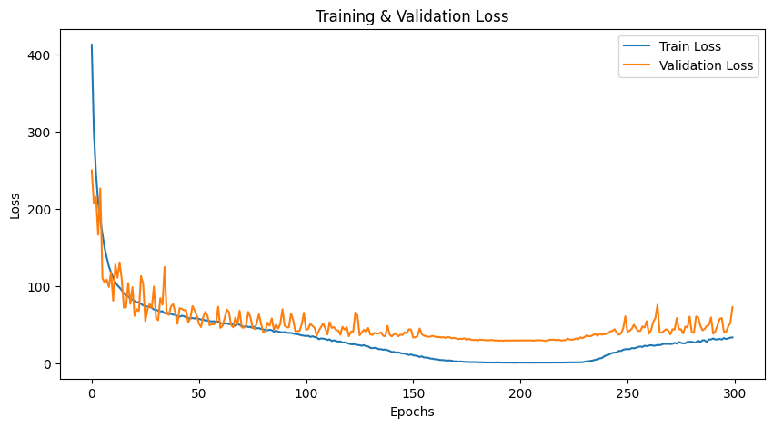
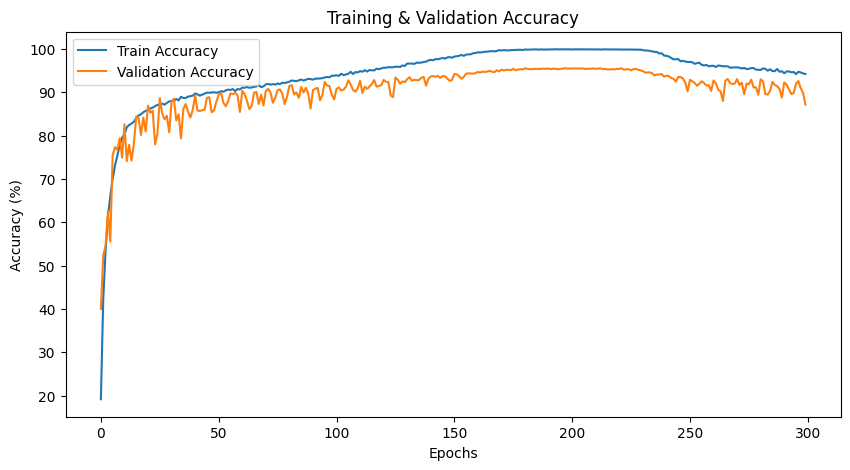
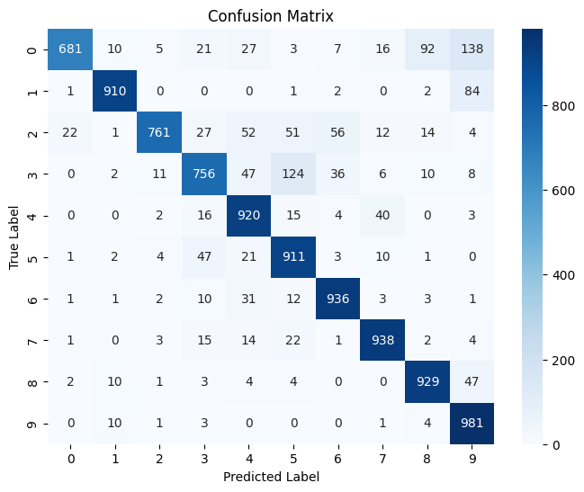

# Detailed Report on Modified ResNet for CIFAR-10 Classification with Squeeze-and-Excitation Blocks

## 1. Introduction

Image classification remains a cornerstone task in computer vision, and Convolutional Neural Networks (CNNs) have continuously evolved to meet increasing performance demands. Residual Networks (ResNets) have been especially impactful due to their ability to train very deep networks using skip connections that mitigate the vanishing gradient problem.

In this project, we design a modified ResNet for CIFAR-10 classification that:
- **Maximizes Accuracy:** Targets state-of-the-art performance on CIFAR-10.
- **Optimizes Efficiency:** Keeps the model under a strict budget of 5 million trainable parameters, making it ideal for deployment on edge devices and IoT applications.
- **Enhances Feature Representation:** Integrates Squeeze-and-Excitation (SE) blocks to recalibrate channel-wise features dynamically, boosting the network's representational power.
- **Improves Convergence:** Utilizes advanced training strategies such as data augmentation, a Cosine Annealing learning rate scheduler, and the Lookahead optimizer to ensure robust training.

Inspired by *Efficient ResNets: Residual Network Design* by Thakur, Chauhan, and Gupta ([arXiv:2306.12100](https://doi.org/10.48550/arXiv.2306.12100)), our approach leverages these modern techniques to build an efficient yet powerful network.

---

## 2. Methodology

### 2.1 Model Architecture & Hyperparameters

#### Modified ResNet Architecture

- **Residual Blocks:**  
  The network is composed of multiple stages, each containing a set of residual blocks. Our configuration uses three stages with block counts `[4, 4, 3]`. Each block consists of two convolutional layers with batch normalization and ReLU activations, along with identity shortcut connections to facilitate gradient flow.

- **Convolutional Layers:**  
  - **Main Convolutions:** Each block uses a 3×3 convolution (`conv_kernel_sizes: [3, 3, 3]`) to extract local spatial features.
  - **Shortcut Connections:** Identity mapping is achieved via 1×1 convolutions (`shortcut_kernel_sizes: [1, 1, 1]`) when the number of channels changes or when downsampling is needed.

- **Channel Depth and Pooling:**  
  The network begins with 64 channels (`num_channels: 64`) and concludes with an average pooling layer (`avg_pool_kernel_size: 8`) to reduce the spatial dimensions before classification.

#### Squeeze-and-Excitation (SE) Blocks

- **Purpose:**  
  SE blocks are integrated to recalibrate the feature maps by modeling channel interdependencies. This mechanism allows the network to emphasize informative features while suppressing less useful ones.

- **Implementation Details:**  
  1. **Squeeze:** Global average pooling compresses the spatial dimensions, producing a channel descriptor.  
  2. **Excitation:** The descriptor passes through two fully connected (or 1×1 convolutional) layers with a ReLU activation followed by a sigmoid function, yielding channel-wise weights.  
  3. **Recalibration:** These weights multiply the original feature maps to dynamically adjust channel responses.

In our configuration, the SE block is enabled (`squeeze_and_excitation: True`), which provides a significant boost in discriminative capability with minimal extra parameters.

#### Hyperparameters Summary

- **Model Hyperparameters:**
  - `num_blocks`: [4, 4, 3]
  - `conv_kernel_sizes`: [3, 3, 3]
  - `shortcut_kernel_sizes`: [1, 1, 1]
  - `num_channels`: 64
  - `avg_pool_kernel_size`: 8
  - `drop`: 0.2 (Dropout rate applied within residual blocks)
  - `squeeze_and_excitation`: True

### 2.2 Optimization and Training Strategy

#### Data Preparation

- **Data Augmentation:**  
  Random cropping (with padding) and random horizontal flipping are applied to enhance the training set diversity (`data_augmentation: True`).

- **Normalization:**  
  Images are normalized using CIFAR-10’s mean and standard deviation (`data_normalize: True`).

#### Training Parameters

- **Batch Size & Data Loader:**  
  - Batch size: 128  
  - Number of workers: 8

- **Training Duration:**  
  The model is trained for 300 epochs (`max_epochs: 300`).

#### Optimization Techniques

- **Base Optimizer:**  
  Stochastic Gradient Descent (SGD) is used with:
  - Learning rate (`lr`): 0.1
  - Momentum: 0.9
  - Weight decay: 5e-4

- **Lookahead Optimizer:**  
  To stabilize and accelerate convergence, SGD is wrapped with a Lookahead optimizer:
  - Lookahead steps (`lookahead_k`): 5
  - Interpolation factor (`lookahead_alpha`): 0.5

- **Learning Rate Scheduler:**  
  A Cosine Annealing scheduler (`lr_sched: "CosineAnnealingLR"`) gradually reduces the learning rate over training epochs.

- **Gradient Clipping:**  
  Not applied in this configuration (`grad_clip: None`).

### 2.3 Implementation Details

- **Framework:**  
  The project is implemented in PyTorch, utilizing its flexible modules for neural network construction, data handling, and GPU acceleration.

- **Code Structure:**
  1. **Model Definition:**  
     The ResNet is built with modular residual blocks that incorporate dropout and optional SE blocks. A helper function (`conv1x1`) is defined for 1×1 convolutions, crucial for shortcut connections and SE block operations.
  2. **Training Pipeline:**  
     The training loop includes:
     - Forward pass with CrossEntropyLoss.
     - Backward propagation and gradient computation.
     - Optimizer updates with the Lookahead mechanism.
     - Logging of loss and accuracy metrics via TensorBoard.
     - Checkpointing when validation accuracy improves.
  3. **Inference Pipeline:**  
     A custom dataset class loads test data from a pickle file (`cifar_test_nolabel.pkl`), and the model’s predictions are saved in a CSV file.
  4. **Utility Functions:**  
     Additional scripts count the model parameters to ensure the total remains under the 5 million parameter threshold.

---

## 3. Experiments and Results

### 3.1 Training & Validation Curves

The figures below illustrate the training and validation curves for both loss and accuracy across 300 epochs.

**Figure 1: Training & Validation Loss**

As seen in Figure 1, the training loss rapidly decreases in the early epochs, then continues to converge gradually. The validation loss follows a similar pattern but is typically higher than the training loss due to the inherent difficulty of generalizing to unseen data.

**Figure 2: Training & Validation Accuracy**

In Figure 2, we observe a steep initial increase in both training and validation accuracy, followed by a slower, more gradual improvement. The model maintains a high level of accuracy throughout the final epochs, demonstrating strong generalization capabilities.

### 3.2 Confusion Matrix

To further analyze class-wise performance, we generate a confusion matrix (Figure 3).

**Figure 3: Confusion Matrix**

From the confusion matrix, we can see that most classes are correctly predicted at high rates, indicating the network’s strong discriminative ability. Misclassifications tend to occur in visually similar classes, which is a common challenge in CIFAR-10.

### 3.3 Overall Performance

- **Convergence:**  
  Training and validation losses/accuracies confirm that the model learns robust feature representations.
- **Parameter Budget:**  
  A parameter counting script verifies that the total trainable parameters remain under 5 million, satisfying the efficiency requirement.
- **Accuracy:**  
  The model demonstrates competitive accuracy compared to larger networks like ResNet18, showcasing the effectiveness of integrating dropout and SE blocks.

---

## 4. System Specifications

All experiments and training processes were conducted on the following hardware and software setup:

- **Environment:** GPU Cloud Instance  
- **CPU:** 32 vCPU  
- **GPU:** Nvidia RTC 4090  
- **System Memory:** 120 GB  
- **Python Version:** 3.10.2  
- **CUDA Version:** v12.1  
- **Torch Version:** 2.2.4  

This high-performance environment allowed for rapid experimentation, large batch sizes, and efficient training.

---

## 5. Conclusion

This project presents a comprehensive exploration of a modified ResNet architecture for CIFAR-10 classification that strikes an effective balance between accuracy and efficiency. Key findings include:

- **Efficient Architecture:**  
  The model is designed to operate under a strict parameter budget (<5 million parameters) by employing a tailored residual block design with configurable kernels, dropout, and SE blocks.

- **Enhanced Feature Recalibration:**  
  The integration of Squeeze-and-Excitation blocks significantly improves the network’s ability to capture and prioritize informative features, boosting overall performance with minimal additional parameters.

- **Robust Training Strategy:**  
  Advanced techniques such as data augmentation, Cosine Annealing learning rate scheduling, and the Lookahead optimizer contribute to stable convergence and high accuracy.

- **Practical Applicability:**  
  The model is well-suited for deployment on resource-constrained devices, as demonstrated by its strong performance despite a limited parameter count.

In summary, our modified ResNet with Squeeze-and-Excitation blocks offers a promising solution for CIFAR-10 classification where both performance and parameter efficiency are critical. Future directions include extending this architecture to other datasets, experimenting with additional regularization techniques, and fine-tuning hyperparameters to further improve performance.
